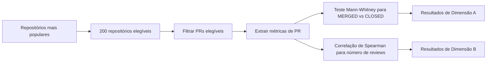

# Apresentação de Slides — Estudo de Code Review no GitHub

---

## Slide 1 — Objetivo do Estudo

- Estudar a atividade de **code review** em pull requests do GitHub.
- Dataset: **200 repositórios mais populares** com PRs elegíveis.
- Pergunta central: quais fatores influenciam se um PR é **MERGED** ou **CLOSED** e quantos reviews ele recebe?

---

## Slide 2 — Metodologia de Coleta

- Seleção: 200 repositórios mais estrelados do GitHub.
- Filtro de PRs:
  - estado final `MERGED` ou `CLOSED`
  - pelo menos **1 review**
  - duração mínima de **1 hora**
- Coleta via **GitHub GraphQL API** com paginação por cursor.
- Exportação para CSV para análise posterior.

---

## Slide 3 — Métricas e Hipóteses

- **Tamanho do PR**: arquivos alterados, adições, deleções.
- **Tempo de análise**: horas entre abertura e fechamento/merge.
- **Descrição**: comprimento do corpo do PR.
- **Interações**: participantes e comentários.

Hipóteses principais:
- PRs menores tendem a ser mais facilmente **merged**.
- Descrições mais completas podem aumentar a chance de **merge**.
- Mais interações e tempo moderado podem influenciar o feedback final.
- PRs maiores e mais longos tendem a receber **mais reviews**.

---

## Slide 4 — Análise e Resultados Esperados

- Dimensão A: comparar `MERGED` x `CLOSED` usando **Mann-Whitney U**.
- Dimensão B: medir associação entre métricas e número de reviews com **Spearman (ρ)**.
- Significância adotada: **α = 0,05**.
- Resultado prático esperado:
  - diferenças significativas entre grupos em pelo menos uma dimensão;
  - correlações positivas entre interações e número de reviews.

---

## Slide 5 — Conclusões e Aplicações

- Trata-se de um estudo empírico observacional de pull requests reais.
- A metodologia combina **mineração de dados** e **análise estatística**.
- Ferramentas principais: Python, pandas, matplotlib/seaborn, scipy e GitHub GraphQL.
- Implicação: entender fatores de code review ajuda mantenedores a priorizar e melhorar o fluxo de revisão.
