# Caracterizando a Atividade de Code Review no GitHub: Um Estudo Empírico

<!-- SLIDE 1: Introdução + Problema + RQs -->
# 1 Introdução

## 1.1 Contextualização

Code review é uma prática central da engenharia de software moderna, pois ajuda a identificar defeitos, disseminar conhecimento e aumentar a qualidade das mudanças antes de sua integração. No ecossistema do GitHub, essa prática ocorre majoritariamente por meio de *pull requests* (PRs), que registram o código proposto, as discussões, os comentários e os reviews formais associados à mudança. Compreender quais fatores influenciam a aceitação de um PR e a intensidade do processo de revisão é relevante tanto para pesquisadores quanto para desenvolvedores e mantenedores de projetos open-source.

## 1.2 Problema

Este estudo busca identificar quais características observáveis dos pull requests influenciam dois desfechos importantes do processo de code review no GitHub: **(A)** se o PR termina em `MERGED` ou `CLOSED`; e **(B)** quantos reviews formais o PR recebe. A análise é feita sob a perspectiva de fatores perceptíveis aos desenvolvedores, como tamanho da mudança, tempo de análise, qualidade contextual da descrição e volume de interações ao redor da revisão.

## 1.3 Questões de Pesquisa

O estudo é guiado pelas seguintes questões de pesquisa:

### Dimensão A — Fatores associados ao merge

- **RQ01:** O tamanho do pull request (arquivos alterados, adições e deleções) influencia seu estado final (`MERGED` vs `CLOSED`)?
- **RQ02:** O tempo de análise do pull request está associado ao seu estado final (`MERGED` vs `CLOSED`)?
- **RQ03:** O tamanho da descrição do pull request influencia seu estado final (`MERGED` vs `CLOSED`)?
- **RQ04:** O nível de interação no pull request (participantes e comentários) influencia seu estado final (`MERGED` vs `CLOSED`)?

### Dimensão B — Fatores associados ao número de reviews

- **RQ05:** O tamanho do pull request (arquivos alterados, adições e deleções) está correlacionado ao número de reviews recebidos?
- **RQ06:** O tempo de análise do pull request está correlacionado ao número de reviews recebidos?
- **RQ07:** O tamanho da descrição do pull request está correlacionado ao número de reviews recebidos?
- **RQ08:** O nível de interação no pull request (participantes e comentários) está correlacionado ao número de reviews recebidos?

## 1.4 Hipóteses Informais

Com base na literatura sobre colaboração em software e na experiência prática com revisão de código, foram formuladas as seguintes hipóteses informais:

**Dimensão A — Fatores associados ao merge (MERGED vs CLOSED):**
PRs integrados tendem a ser menores (H01), ter tempo de análise moderado — nem curto demais nem excessivamente longo (H02), possuir descrições mais completas (H03) e apresentar interações mais qualificadas (H04).

**Dimensão B — Fatores associados ao número de reviews:**
PRs maiores (H05), com maior tempo em análise (H06), descrições mais detalhadas (H07) e maior atividade de comentários e participantes (H08) tendem a receber mais reviews.

## 1.5 Objetivos

**Objetivo principal:** Caracterizar empiricamente a atividade de code review em pull requests do GitHub, identificando fatores associados ao merge de mudanças e ao número de reviews recebidos.

**Objetivos específicos:**

1. Construir um dataset de PRs provenientes dos 200 repositórios mais populares do GitHub.
2. Coletar, para cada PR, métricas de tamanho, tempo de análise, descrição e interação.
3. Comparar os grupos `MERGED` e `CLOSED` com testes estatísticos apropriados.
4. Medir correlações entre as métricas observadas e o número de reviews.
5. Confrontar os resultados obtidos com as hipóteses informais do estudo.

---

<!-- SLIDE 2: Metodologia + Diagrama -->
# 2 Metodologia

Este trabalho caracteriza-se como um estudo empírico observacional com mineração de dados públicos do GitHub. O dataset é formado pelos **200 repositórios mais estrelados** que possuem **ao menos 100 pull requests** com estado final `MERGED` ou `CLOSED`. Após a seleção dos repositórios, são considerados apenas PRs com **pelo menos 1 review** e **duração mínima de 1 hora** entre criação e fechamento/merge.

A coleta ocorre em duas etapas: (1) descoberta dos repositórios elegíveis via **GitHub GraphQL API**; e (2) coleta paginada pull requests por repositório, também via GraphQL. A análise quantitativa utiliza o teste de **Mann-Whitney U** para a Dimensão A e a **correlação de Spearman** para a Dimensão B, sempre com **α = 0,05**.

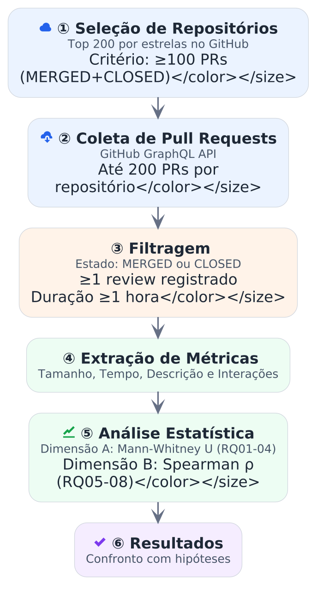

## 2.1 Métricas analisadas

| Dimensão | Métricas |
| --- | --- |
| Tamanho | `changed_files`, `additions`, `deletions` |
| Tempo de análise | `time_to_close_hours` |
| Descrição | `body_length` |
| Interações | `participants_count`, `comments_count` |
| Variável dependente A | `state` (`MERGED` / `CLOSED`) |
| Variável dependente B | `reviews_count` |

---

# 3 Resultados

<!-- SLIDE 3: Dataset + Dimensão A -->
## 3.1 Visão Geral do Dataset

O dataset final contém **12.955 pull requests** provenientes de **188 repositórios únicos** dentre os 200 inicialmente selecionados. Desse total, **10.053 PRs (77,6%)** terminaram em `MERGED` e **2.902 PRs (22,4%)** em `CLOSED`. Considerando toda a amostra, a mediana de `reviews_count` foi **2,0**.

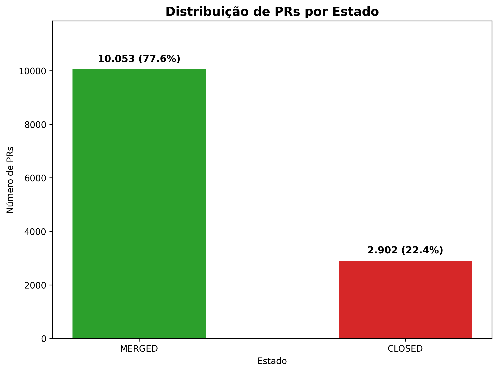

As distribuições das métricas indicam forte assimetria à direita: a maior parte dos PRs é relativamente pequena, com poucas interações, enquanto tempo de análise, tamanho de descrição e volume de comentários apresentam caudas longas. Isso reforça a escolha de testes não paramétricos para a análise.

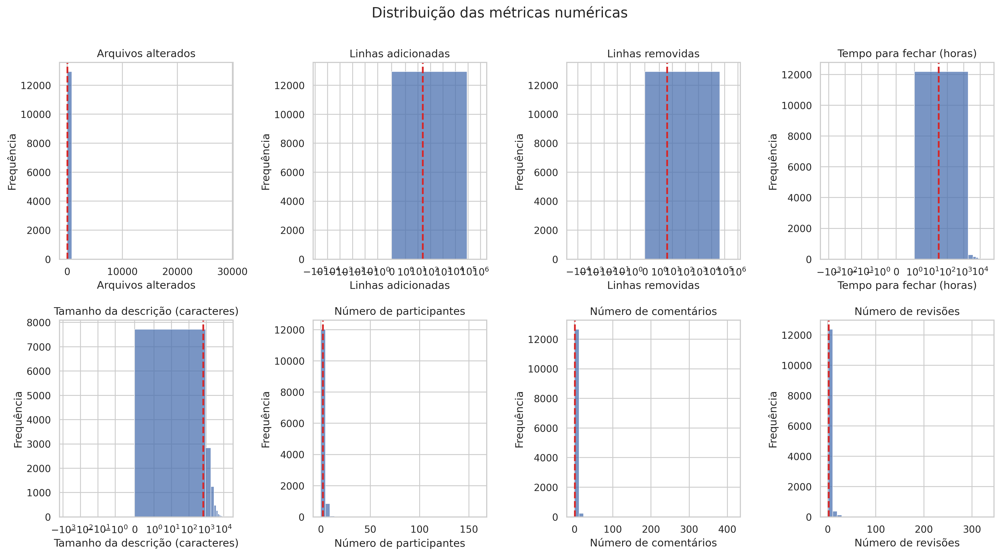

## 3.2 Dimensão A — Resultados Consolidados

De forma agregada, a Dimensão A mostra diferenças estatisticamente detectáveis entre `MERGED` e `CLOSED` para tamanho, tempo de análise, tamanho da descrição e parte das interações. As distribuições visuais abaixo complementam os testes de Mann-Whitney U.

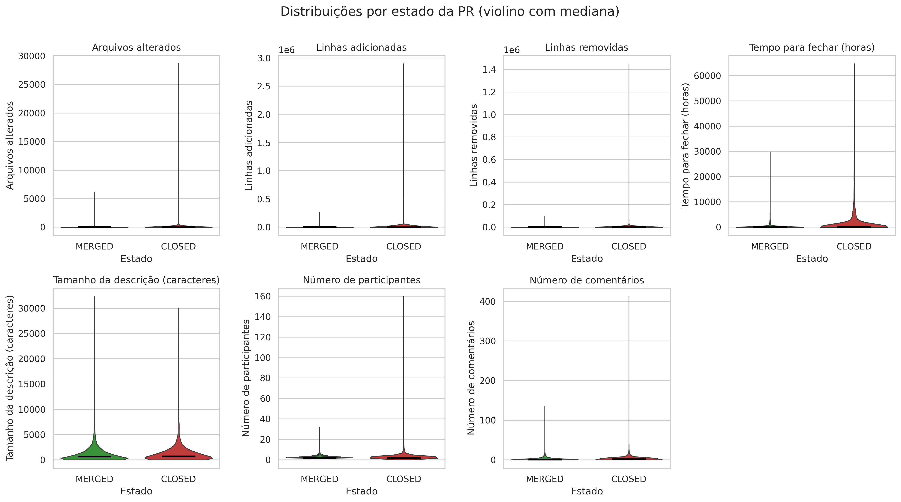

Algumas métricas (e.g., linhas adicionadas, tempo de análise) possuem distribuições altamente assimétricas com outliers extremos que comprimem a visualização. A figura abaixo apresenta os mesmos dados com o eixo Y limitado ao intervalo interquartil (IQR×1.5), permitindo uma melhor comparação visual entre os grupos MERGED e CLOSED:

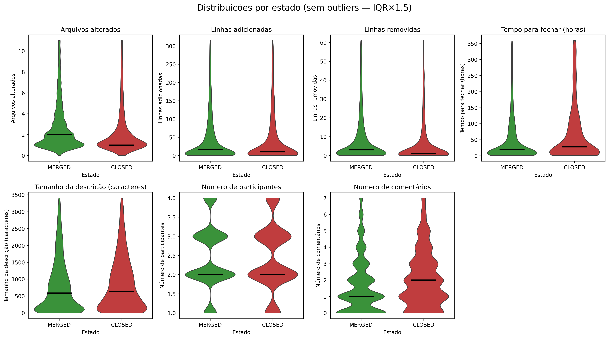

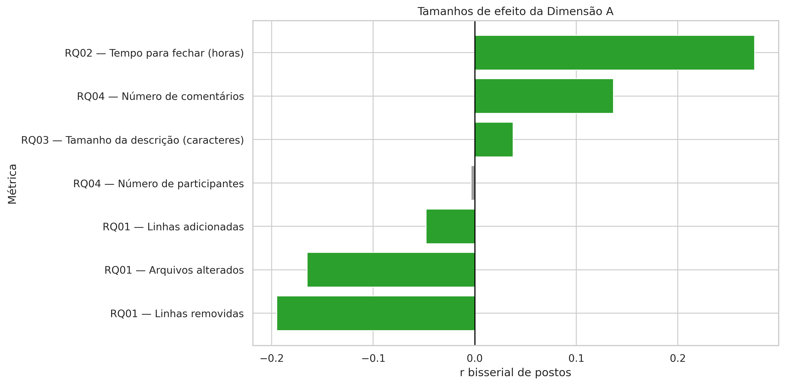

| RQ | Métrica | Mediana MERGED | Mediana CLOSED | U | p-valor | r | Interpretação |
| --- | --- | ---: | ---: | ---: | ---: | ---: | --- |
| RQ01 | `changed_files` | 2.0 | 1.0 | 16995601.5 | 7.80×10⁻⁴⁵ | -0.165 | efeito fraco |
| RQ01 | `additions` | 26.0 | 20.0 | 15286229.5 | 7.92×10⁻⁵ | -0.048 | efeito negligível |
| RQ01 | `deletions` | 5.0 | 2.0 | 17431931.5 | 1.82×10⁻⁵⁸ | -0.195 | efeito fraco |
| RQ02 | `time_to_close_hours` | 24.26h | 89.71h | 10567373.0 | 1.45×10⁻¹¹³ | 0.276 | efeito fraco |
| RQ03 | `body_length` | 665 caracteres | 717 caracteres | 14034456.0 | 1.85×10⁻³ | 0.038 | efeito negligível |
| RQ04 | `participants_count` | 2.0 | 2.0 | 14641326.0 | 0.747 | -0.004 | efeito negligível |
| RQ04 | `comments_count` | 1.0 | 2.0 | 12592963.0 | 1.75×10⁻³⁰ | 0.137 | efeito fraco |

**RQ01 — Tamanho do PR.** Os três testes foram **estatisticamente significativos** (`p < 0,05`). Como o coeficiente rank-biserial foi **negativo**, o primeiro grupo (`MERGED`) tende a apresentar valores mais altos; neste dataset, PRs `MERGED` foram ligeiramente **maiores**, e não menores, do que PRs `CLOSED`.

**RQ02 — Tempo de análise.** `time_to_close_hours` apresentou o **maior efeito da dimensão** (`r = 0.276`). PRs `CLOSED` permaneceram muito mais tempo abertos do que PRs `MERGED` (**89,71h** vs **24,26h**), sugerindo estagnação ou impasse como sinal relevante de não integração.

**RQ03 — Tamanho da descrição.** Houve **significância estatística**, mas com **efeito negligível** (`r = 0.038`). Na prática, descrições ligeiramente maiores apareceram em `CLOSED` (**717** vs **665** caracteres), indicando que comprimento bruto não explica o merge.

**RQ04 — Interações.** Para `participants_count`, **não houve diferença estatisticamente significativa** (`p = 0,747`). Já `comments_count` foi maior em `CLOSED`, com **efeito fraco** (`r = 0.137`), sugerindo que mais comentários podem refletir fricção, retrabalho ou controvérsia.

As figuras individuais abaixo detalham cada RQ da Dimensão A:

**RQ01 — Tamanho:** Violin plots em escala logarítmica comparando `changed_files`, `additions` e `deletions` entre MERGED e CLOSED. As medianas anotadas mostram que PRs integrados apresentam valores ligeiramente superiores (med=2 vs 1 em arquivos, 26 vs 20 em adições, 5 vs 2 em deleções).

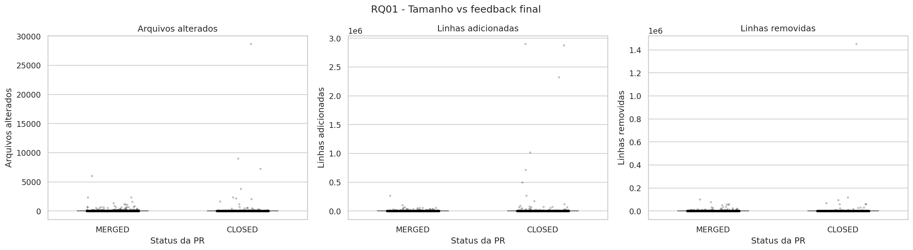

**RQ02 — Tempo de análise:** Distribuição de `time_to_close_hours` por estado. A separação visual é evidente — PRs CLOSED possuem cauda muito mais longa, com mediana ~4× maior que MERGED.

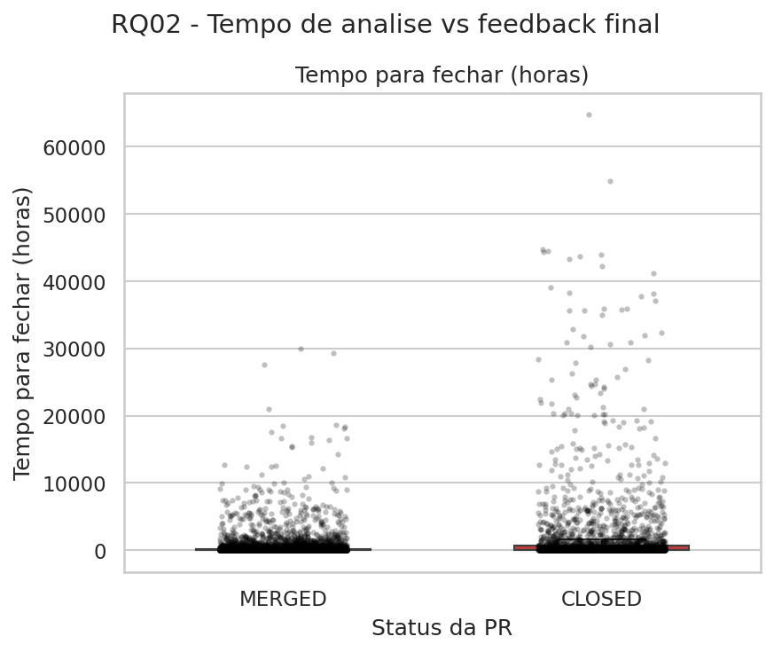

**RQ03 — Descrição:** Comparação de `body_length` entre os grupos. As distribuições são muito semelhantes, consistente com o efeito negligível encontrado no teste estatístico.

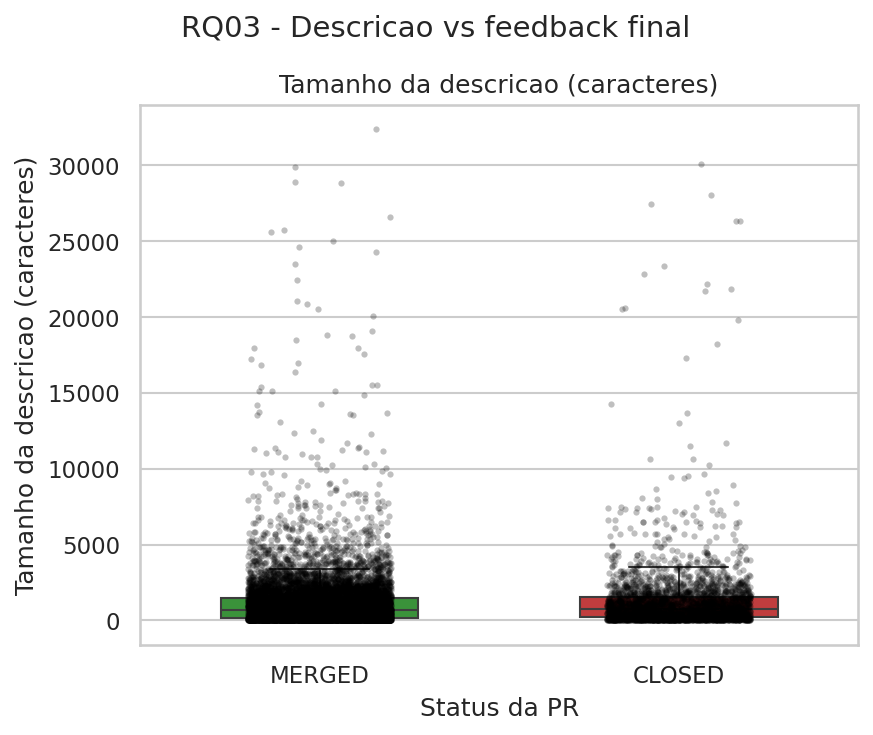

**RQ04 — Interações:** Box plots de `participants_count` e `comments_count`. Para participantes, as distribuições são praticamente idênticas; para comentários, PRs CLOSED apresentam leve deslocamento para cima.

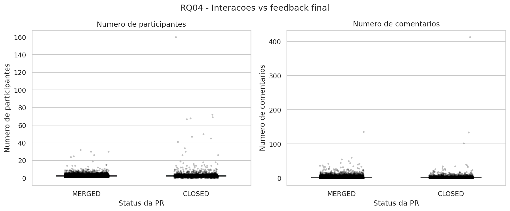

<!-- SLIDE 4: Dimensão B -->
## 3.3 Dimensão B — Resultados Consolidados

Na Dimensão B, avaliamos a correlação monotônica entre as métricas observadas e `reviews_count` por meio da correlação de Spearman. De forma geral, todas as correlações foram positivas, mas com magnitudes predominantemente fracas; a mediana global de `reviews_count` foi **2,0**.

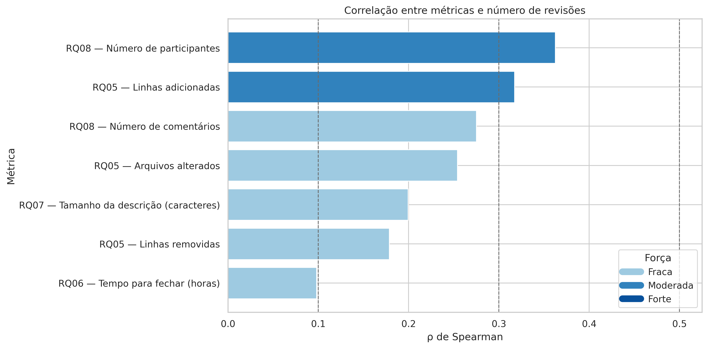

| RQ | Métrica | Mediana | ρ (Spearman) | p-valor | Interpretação |
| --- | --- | ---: | ---: | ---: | --- |
| RQ05 | `changed_files` | 2.0 | 0.254 | 4.56×10⁻¹⁹⁰ | efeito fraco |
| RQ05 | `additions` | 24.0 | 0.317 | 3.25×10⁻³⁰¹ | efeito moderado |
| RQ05 | `deletions` | 4.0 | 0.179 | 1.94×10⁻⁹³ | efeito fraco |
| RQ06 | `time_to_close_hours` | 30.12h | 0.098 | 3.36×10⁻²⁹ | efeito negligível |
| RQ07 | `body_length` | 678 caracteres | 0.200 | 2.05×10⁻¹¹⁶ | efeito fraco |
| RQ08 | `participants_count` | 2.0 | 0.363 | ≈0 (underflow) | efeito moderado |
| RQ08 | `comments_count` | 1.0 | 0.275 | 6.12×10⁻²²⁴ | efeito fraco |

**RQ05 — Tamanho do PR.** Todas as correlações foram **estatisticamente significativas** (`p < 0,05`) e **positivas**. Isso sugere que PRs maiores tendem a receber mais reviews, com destaque para `additions`, única métrica com **efeito moderado** (`ρ = 0,317`).

**RQ06 — Tempo de análise.** Houve **significância estatística**, mas com **efeito negligível** (`ρ = 0,098`). Portanto, embora PRs que ficam mais tempo abertos tendam a acumular mais reviews, essa associação é muito fraca em termos práticos.

**RQ07 — Tamanho da descrição.** `body_length` apresentou correlação **positiva** e de **magnitude fraca** (`ρ = 0,200`). Assim, descrições mais longas tendem a estar associadas a mais reviews, embora o efeito esteja longe de ser dominante.

**RQ08 — Interações.** As duas correlações foram **estatisticamente significativas** (`p < 0,05`), e `participants_count` apresentou a **maior associação de toda a Dimensão B** (`ρ = 0,363`, efeito moderado). `comments_count` também mostrou associação positiva, mas com **efeito fraco** (`ρ = 0,275`).

As figuras individuais abaixo detalham cada RQ da Dimensão B, mostrando scatter plots com linha de tendência LOWESS:

**RQ05 — Tamanho vs Reviews:** PRs com mais linhas adicionadas tendem a receber mais revisões. A tendência é mais clara em `additions` (ρ=0.317) do que em `deletions` (ρ=0.179).

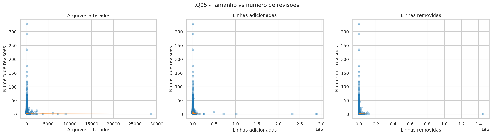

**RQ06 — Tempo vs Reviews:** A relação entre tempo aberto e número de reviews é quase plana, confirmando a correlação negligível (ρ=0.098).

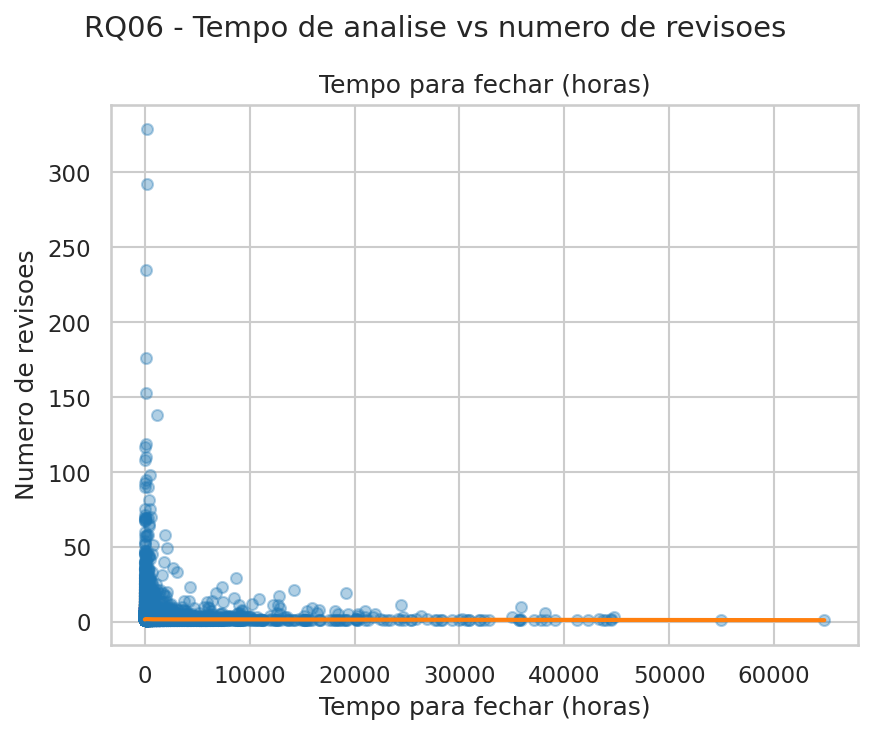

**RQ07 — Descrição vs Reviews:** Descrições mais longas apresentam tendência positiva fraca com o número de reviews (ρ=0.200).

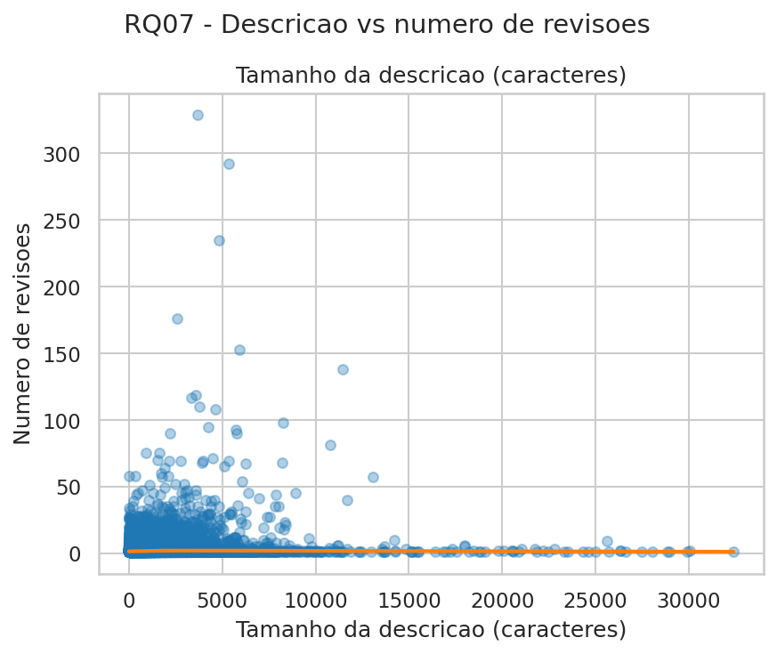

**RQ08 — Interações vs Reviews:** A associação mais forte do estudo: mais participantes e comentários estão claramente ligados a mais reviews (ρ=0.363 e ρ=0.275, respectivamente).

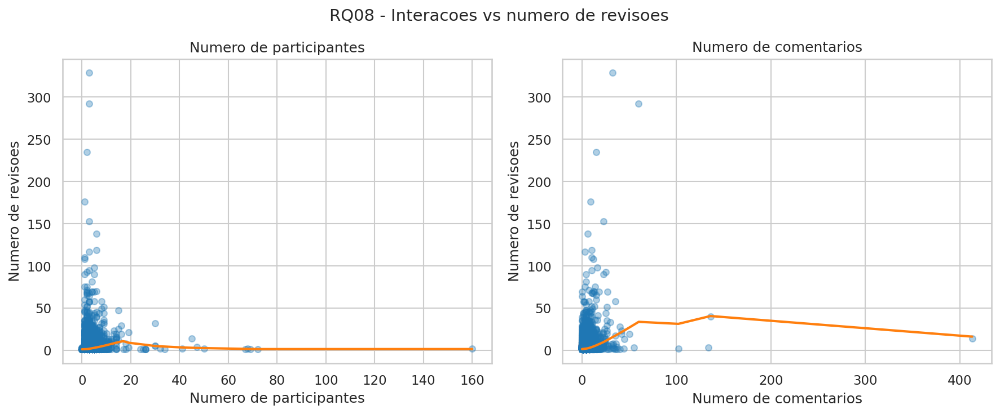

A matriz abaixo resume todas as correlações de Spearman entre as variáveis numéricas do dataset, permitindo identificar visualmente quais métricas possuem associações mais fortes entre si:

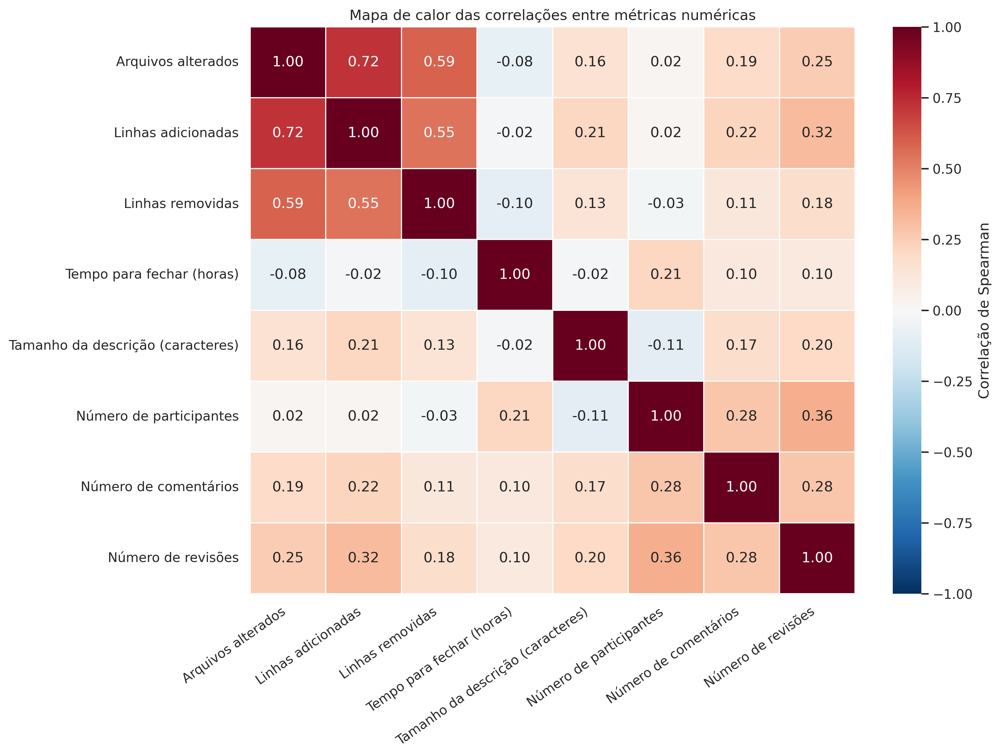

---

<!-- SLIDE 5: Discussão + Conclusão -->
# 4 Discussão

Os resultados mostram que a atividade de code review, no conjunto analisado, é influenciada por múltiplos fatores, mas com intensidades distintas. Na **Dimensão A**, o sinal mais claro para o estado final do PR foi o **tempo de análise**; na **Dimensão B**, o número de reviews cresceu principalmente com **participantes**, **comentários** e, em menor grau, com o **tamanho do PR**.

## 4.1 Confronto com as hipóteses

- **H01** — ❌ **Refutada**: houve diferença estatística, mas PRs `MERGED` foram ligeiramente maiores em `changed_files`, `additions` e `deletions` (`r` entre `-0.048` e `-0.195`).
- **H02** — ✅ **Confirmada**: `time_to_close_hours` diferenciou claramente os grupos (`24,26h` em `MERGED` vs `89,71h` em `CLOSED`, `r = 0.276`).
- **H03** — ⚠️ **Parcial**: `body_length` teve efeito negligível (`r = 0.038`) e direção oposta à hipótese, com descrições um pouco maiores em `CLOSED`.
- **H04** — ⚠️ **Parcial**: `participants_count` não diferiu entre os grupos, e `comments_count` foi maior em `CLOSED` (`r = 0.137`).
- **H05** — ✅ **Confirmada**: todas as métricas de tamanho correlacionaram positivamente com `reviews_count` (`ρ = 0.179` a `0.317`).
- **H06** — ⚠️ **Parcial**: a correlação entre tempo de análise e `reviews_count` foi positiva, mas negligível (`ρ = 0.098`).
- **H07** — ✅ **Confirmada**: `body_length` apresentou correlação positiva e fraca com `reviews_count` (`ρ = 0.200`).
- **H08** — ✅ **Confirmada**: as métricas de interação tiveram as associações mais fortes com `reviews_count`, sobretudo `participants_count` (`ρ = 0.363`).

## 4.2 Principais achados e surpresas

O principal achado foi que o **tempo de análise** discrimina melhor o desfecho do PR do que métricas de tamanho ou descrição. Também surgiram resultados contraintuitivos: PRs `MERGED` foram ligeiramente maiores, e descrições mais longas ou mais comentários apareceram mais associados a `CLOSED`, sugerindo que volume de texto pode refletir complexidade, retrabalho ou controvérsia, e não necessariamente clareza ou colaboração produtiva.

---

# 5 Conclusão

Este estudo analisou **12.955 pull requests** de **188 repositórios** do GitHub para caracterizar fatores associados ao estado final dos PRs e ao número de reviews recebidos. O achado mais forte foi o **tempo de análise**: PRs `CLOSED` permaneceram abertos muito mais tempo do que PRs `MERGED`. Para o número de reviews, as associações mais relevantes vieram das métricas de **interação**, especialmente `participants_count`, seguidas por `comments_count` e por parte das métricas de tamanho. Também observamos que PRs `MERGED` foram ligeiramente maiores e que descrições mais longas não implicaram maior chance de merge. Na prática, equipes podem usar sinais de estagnação e de dinâmica social para priorizar revisões e identificar PRs com maior risco de não integração.

---

# Referências

- GitHub. *GraphQL API Documentation*. Disponível em: <https://docs.github.com/en/graphql>.
- Spearman, C. (1904). *The proof and measurement of association between two things*.
- Mann, H. B.; Whitney, D. R. (1947). *On a test of whether one of two random variables is stochastically larger than the other*.